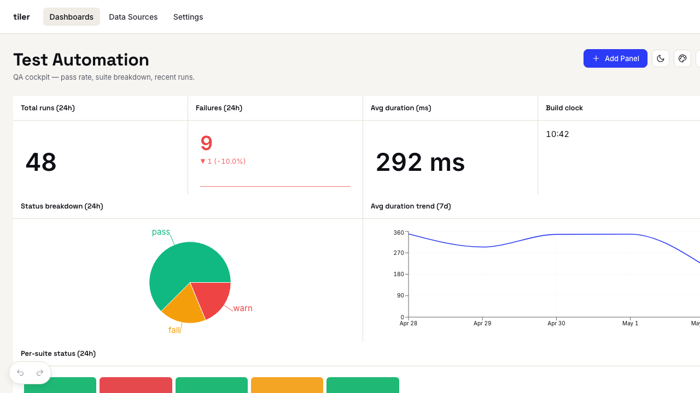

<p align="center">
  
</p>

<p align="center">
  Plug-and-play dashboards for TypeScript / Node.js. Playwright-first.
</p>

<p align="center">
  <a href="https://github.com/aguspe/tiler-ts/actions/workflows/ci.yml"></a>
  <a href="https://github.com/aguspe/tiler-ts/actions/workflows/docs.yml"></a>
  <a href="https://aguspe.github.io/tiler-ts/"></a>
  <a href="LICENSE"></a>
</p>

---

`tiler-ts` is a set of npm packages for building dashboards in TypeScript / Node.js — schema-first data, 14 first-party widgets, and a drag-and-drop editor that auto-saves over the wire. The package set is Playwright-friendly out of the box: drop the reporter into `playwright.config.ts` and you get a self-contained HTML dashboard at the end of every test run, or run the live server and stream results in real time.

<p align="center">
  
</p>

## 30-second tour

```bash
npx @aguspe/tiler-cli init     # scaffolds tiler.config.ts + .env.example
npx @aguspe/tiler-cli serve    # boots Fastify; opens http://localhost:4567/dashboards
```

Drop a widget on the grid with the **+ Add Panel** button. The drawer shows a live preview that updates as you edit the JSON; **Use example** fills it with the widget's canonical config. Edits auto-save; ⌘Z undoes; **TV** flips into kiosk mode for displays; **🌙** toggles dark.

For Playwright runs (no server, just a static report):

```bash
npm i -D @aguspe/tiler-playwright
```

```ts
// playwright.config.ts
import { defineConfig } from "@playwright/test";
export default defineConfig({
  reporter: [["@aguspe/tiler-playwright", { outDir: "tiler-report" }]],
});
```

The deeper how-to lives at **[aguspe.github.io/tiler-ts](https://aguspe.github.io/tiler-ts/)** — start with the [intro](https://aguspe.github.io/tiler-ts/), then pick a path (static reporter, live server, or the JSON-import bridge).

## Examples

- [`examples/playwright-static/`](examples/playwright-static/) — Playwright reporter demo.
- [`examples/server-live/`](examples/server-live/) — Fastify server demo with sqlite + seeded data + curl webhook examples. After `pnpm seed && pnpm start`, open http://127.0.0.1:4567/dashboards/test_automation to drive the editor.
- [`examples/e2e/`](examples/e2e/) — Playwright visual regression + interaction suite for the editor.

## Workspace pipeline

| Command | What it does |
|---|---|
| `pnpm test` | Vitest across packages — 270+ tests covering schemas, resolvers, widgets, SSR, reporter, server routes, sqlite store, refresh manager, editor |
| `pnpm typecheck` | `tsc --noEmit` across packages |
| `pnpm lint` | Biome lint + format check |
| `pnpm format` | Biome format --write |
| `pnpm build` | tsup + Vite builds for each package |
| `pnpm size` | size-limit budget enforcement |
| `pnpm deps` | dependency-cruiser boundary checks |

CI runs all of the above on every PR (Node 20 + 22, ubuntu + macos).

## Packages

| Package | What it does |
|---|---|
| [`@aguspe/tiler-core`](packages/core/README.md) | Schemas, registry, MemoryStore, helpers, presets, `buildSnapshot`, `defineConfig` |
| [`@aguspe/tiler-widgets`](packages/widgets/README.md) | 14 widgets + design tokens |
| [`@aguspe/tiler-viewer`](packages/viewer/README.md) | Read-only SSR + hydration |
| [`@aguspe/tiler-playwright`](packages/playwright/README.md) | Static-report Playwright reporter |
| [`@aguspe/tiler-server`](packages/server/README.md) | Fastify + sqlite + ingestion + WebSocket |
| [`@aguspe/tiler-editor`](packages/editor/README.md) | Drag/drop editor with auto-save + drawer preview |
| [`@aguspe/tiler-cli`](packages/cli/README.md) | `tiler init`/`serve`/`doctor`/`import-playwright-json` |

## License

[MIT](LICENSE)
