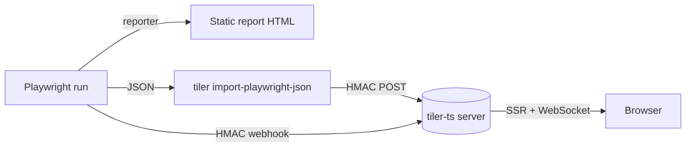

`tiler-ts` is a TypeScript port of the Rails [`tiler`](https://github.com/aguspe/tiler) engine — plug-and-play dashboards built around schema-first data, a 14-widget set, and a drag-and-drop editor. This site focuses on the **Playwright story**: how to surface your test runs as a tiler dashboard.

You have three options, increasing in commitment:

| Surface | What it gives you | When you'd pick it |
|---|---|---|
| **[Static reporter](./reporter.md)** | A self-contained HTML dashboard generated at the end of every Playwright run. No server, no DB. | Solo / small teams. CI artifact. Open with `file://`. |
| **[Live server](./live-server.md)** | A long-running Fastify server with sqlite + WebSocket live updates, ingesting from your test runs. | Teams who want history across runs and a TV in the office. |
| **[`tiler import-playwright-json`](./cli-import.md)** | One-shot conversion of an existing Playwright JSON report into ingest records, either to disk or HMAC-POSTed to a server. | Bridge mode — keep the default Playwright reporter, fan results out to a tiler server. |

Pick one to start; you can switch later without losing your test history if you ingest into the same data source slug.

## What you'll see

Whichever surface you pick, the dashboard ships with the **`test_automation` preset**: a curated set of nine panels driven by a `test_runs` data source whose records carry `suite`, `test_name`, `status`, `duration_ms`, and `environment`.

Headline panels:

- **Total runs (24h)** — a single big number.
- **Failures (24h)** — number with a sparkline + WoW delta.
- **Avg duration (ms)** — metric with unit.
- **Status breakdown (24h)** — pie chart.
- **Avg duration trend (7d)** — line chart.
- **Per-suite status (24h)** — status grid (one cell per suite).
- **Failures by suite (24h)** — bar chart.
- **Recent failures (24h)** — table of the last failed runs.

Each panel is a regular tiler widget — see the [widgets tour](./widgets-tour.md) for what else is in the set.

## Mental model

Every flow ultimately produces records that match the `test_runs` schema. The widgets resolve those records into the visible panels — which means a custom widget you write once works in all three surfaces.

## Next

- [Static reporter →](./reporter.md)
- [Live server →](./live-server.md)
- [CLI: import-playwright-json →](./cli-import.md)
